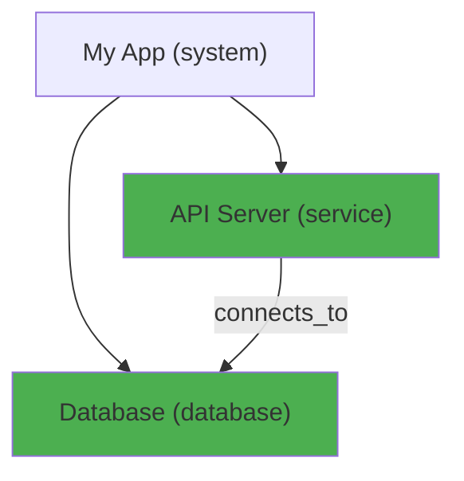

# Blueprint MCP — Phases 6 through 10

## How to Use This Document

Feed each phase to Claude Code one at a time using plan mode:

```
Read PHASE_6_TO_10_PLAN.md and go into plan mode for Phase 6. Show me your implementation plan before writing code.
```

After each phase, restart Claude Code to pick up changes (`/exit` then `claude`).

---

## Phase 6 — Extended Node Types & Natural Language Queries

### 6A: Extended Node Types

The current `NodeType` enum is web-dev focused. Extend it to support any language and project type.

**Add these node types to `src/models.py` NodeType enum:**

```
submodule    — a module nested inside another module
class_def    — a class definition (use class_def to avoid Python keyword collision)
struct       — a struct or data type
protocol     — an interface, protocol, or trait
view         — a UI view or component
test         — a test suite or test file
script       — a standalone script or CLI tool
middleware   — request/response middleware
migration    — a database migration file
webhook      — an incoming webhook handler
worker       — a background worker or consumer process
model        — a data model or ORM model (distinct from table)
schema       — an API schema, GraphQL schema, or validation schema
enum_def     — an enum definition (use enum_def to avoid collision)
util         — a utility or helper module
```

**Update:**
- `src/models.py` — add to NodeType enum
- `src/scanner/python_scanner.py` — detect classes, models, enums in Python files
- `src/scanner/javascript_scanner.py` — detect React components as `view` nodes
- All template JSON files — review and use more specific types where appropriate
- Tests — add validation tests for all new types, test that scanners detect them

### 6B: Natural Language Query Tool

Add a `query_blueprint` MCP tool that accepts plain English questions and returns relevant nodes and connections.

**New MCP tool: `query_blueprint`**

Parameters:
```json
{
    "question": "string (required) — Natural language question like 'what connects to the database?' or 'show me everything related to auth'"
}
```

Implementation approach:
- Parse the question for key terms (node names, types, relationship words)
- Map relationship words to query strategies:
  - "connects to", "talks to", "uses" → find edges where target matches
  - "depends on", "needs" → find edges with depends_on relationship
  - "related to" → find all edges where node is source OR target
  - "what is", "show me" → find nodes by name/type match
- Search node names, descriptions, and types for keyword matches
- Return matching nodes with their connections and a human-readable summary

**New file:** `src/query.py` — query parsing and execution logic

**Tests:** Create blueprints with known structures, ask natural language questions, assert the correct nodes are returned. Test at least:
- "what connects to the database" → returns all nodes with edges to database nodes
- "show me all routes" → returns all route-type nodes
- "what does the auth module depend on" → returns auth's outgoing edges
- "find broken things" → returns nodes with status=broken
- Questions with no matches → returns empty with helpful message

### 6C: Architecture Review Prompt Generator

Add a `get_review_prompt` MCP tool that formats the entire blueprint into a structured analysis document optimized for Claude (or any LLM) to review. This does NOT call an LLM itself — it prepares the data so when Claude Code reads the output, it can give high-quality architectural advice with zero extra API cost.

**New MCP tool: `get_review_prompt`**

Parameters:
```json
{
    "focus": "string (optional) — Area to focus review on: 'architecture', 'security', 'performance', 'completeness', 'connections', 'all' (default: 'all')",
    "node_id": "string (optional) — Scope review to a specific subtree instead of full project"
}
```

Returns a structured text document (not JSON — this is meant to be read by an LLM):

```
=== ARCHITECTURE REVIEW REQUEST ===

PROJECT: Gas Mart Platform
GENERATED: 2026-03-16T20:41:00Z

--- SYSTEM OVERVIEW ---
Total nodes: 42 (28 built, 10 planned, 3 in_progress, 1 broken)
Total connections: 31
Health score: 73/100 (Grade: B)

--- ARCHITECTURE LAYERS ---

Layer 1: System Root
  └── Gas Mart Platform (system) [built]

Layer 2: Services & Infrastructure  
  ├── API Service (service) [built] — Central FastAPI backend
  │   Connects to: Primary Database (connects_to), Cache (reads_from)
  │   Children: Auth, Payroll, Sales, Compliance, ATM, Fuel modules
  ├── Dashboard Frontend (service) [built] — React management dashboard
  │   Connects to: API Service (calls)
  ├── Notifications (service) [planned] — Email/SMS alerts
  │   Connects to: nothing ⚠️ ORPHANED
  └── BI Dashboard (service) [planned]
      Connects to: Primary Database (reads_from)

Layer 3: Database & Tables
  ├── Primary Database (database) [built]
  │   Tables: companies, stores, employees, daily_sales, fuel_inventory, atm_machines, compliance_records
  │   ⚠️ No table for: sessions, audit_log, notifications
  ...

--- CONNECTIONS MAP ---
API Service → Primary Database (connects_to, "SQLAlchemy")
Auth → employees (reads_from, "User verification")  
Payroll → employees (reads_from, "Employee data")
Sales → daily_sales (writes_to, "Daily sales entry")
POS Integration → daily_sales (writes_to, "POS data sync")
...

--- CURRENT ISSUES (from analyzer) ---
CRITICAL: Notifications service has zero connections — nothing triggers it
WARNING: No authentication connection to 5 API routes
WARNING: compliance_records table has reads but no writes — how does data get in?
INFO: 10 planned nodes older than 14 days

--- NODES WITHOUT DESCRIPTIONS (12) ---
Cache, Job Queue, ...

--- PLANNED BUT NOT BUILT (10) ---
Notifications (planned 30 days ago)
BI Dashboard (planned 30 days ago)
Cache (planned 30 days ago)
...

--- REVIEW QUESTIONS ---
Based on this architecture:

1. MISSING COMPONENTS: What standard components for this type of application are missing from the blueprint? Consider auth flows, error handling, logging, rate limiting, health checks, backup strategies.

2. BROKEN PATTERNS: Do any connections seem wrong, circular, or indicate a design smell? Are there components that should be connected but aren't?

3. SECURITY GAPS: Are there routes or services exposed without auth? Data flows that bypass validation? Sensitive data (PII, financial) without encryption annotations?

4. PERFORMANCE CONCERNS: Are there potential bottlenecks? Services that fan out to too many dependencies? Missing cache layers? Database tables that will grow unbounded without archival?

5. OPERATIONAL READINESS: What's needed before this can run in production? Missing monitoring, alerting, deployment pipeline, backup, disaster recovery?

6. DEPENDENCY RISKS: Are there single points of failure? External services without fallbacks? Components where a failure would cascade?

7. QUICK WINS: What are the 3 easiest improvements that would have the biggest impact on this architecture?
```

**Implementation approach:**
- Pull full blueprint via `get_blueprint()`
- Pull issues via `find_issues()` (from analyzer)
- Pull health score via `health_report()` (from Phase 8 — if not yet built, skip this section)
- Build a hierarchical layer view by walking parent_id relationships
- Build a connection map sorted by source node
- Identify orphaned nodes, missing descriptions, stale planned nodes
- Format everything as readable text with the review questions at the end
- The `focus` parameter controls which review questions are included:
  - `architecture` → questions 1, 2
  - `security` → question 3
  - `performance` → question 4
  - `completeness` → questions 1, 5
  - `connections` → questions 2, 6
  - `all` → all questions

**New file:** `src/review.py` — review prompt generation logic
**Update:** `src/server.py` — register get_review_prompt tool

**Tests:**
- Generate review prompt for a SaaS template → output contains all node names, all connections, all issues
- Generate review prompt with focus="security" → only security questions included
- Generate review prompt scoped to a subtree → only that subtree's nodes appear
- Empty blueprint → still returns valid prompt with "no nodes found" message
- Review prompt includes orphaned nodes and missing descriptions accurately

**Usage in practice:**
```
# In Claude Code, in any project:
> Call get_review_prompt

# Claude Code reads the output and immediately gives architectural advice
# No extra API call, no cost, uses whatever model is already running
# User can also copy the output and paste it into claude.ai for a second opinion
```

---

## Phase 7 — Version Snapshots & Dependency Impact Analysis

### 7A: Version Snapshots

Add the ability to snapshot the current blueprint state and compare snapshots over time.

**New SQLite table:**
```sql
CREATE TABLE snapshots (
    id TEXT PRIMARY KEY,
    name TEXT NOT NULL,
    description TEXT,
    node_data TEXT NOT NULL,    -- JSON dump of all nodes at snapshot time
    edge_data TEXT NOT NULL,    -- JSON dump of all edges at snapshot time
    node_count INTEGER NOT NULL,
    edge_count INTEGER NOT NULL,
    created_at TEXT NOT NULL DEFAULT (datetime('now'))
);
```

**New MCP tools:**

`snapshot_blueprint` — Save current state
```json
{
    "name": "string (required) — Snapshot name like 'before-refactor' or 'v1.0'",
    "description": "string (optional) — What this snapshot captures"
}
```
Returns: `{ "id": "uuid", "name": "...", "node_count": 42, "edge_count": 18 }`

`list_snapshots` — List all saved snapshots
```json
{}
```
Returns: Array of snapshots with id, name, description, counts, created_at

`compare_snapshots` — Diff two snapshots or a snapshot vs current state
```json
{
    "snapshot_id": "string (required) — Snapshot to compare from",
    "compare_to": "string (optional) — Another snapshot ID. If omitted, compares to current state"
}
```
Returns:
```json
{
    "nodes_added": [{"name": "...", "type": "..."}],
    "nodes_removed": [{"name": "...", "type": "..."}],
    "nodes_changed": [{"name": "...", "field": "status", "from": "planned", "to": "built"}],
    "edges_added": [...],
    "edges_removed": [...],
    "summary": "Added 5 nodes, removed 2, changed 3. 4 nodes moved from planned to built."
}
```

`restore_snapshot` — Restore blueprint to a previous snapshot state
```json
{
    "snapshot_id": "string (required)",
    "confirm": "boolean (required) — Must be true to execute. This replaces the current blueprint."
}
```

**Update:** `src/db.py` — add snapshot CRUD methods
**New file:** `src/snapshots.py` — snapshot logic, diff algorithm
**Update:** `src/server.py` — register 4 new tools

**Tests:** Real integration tests:
- Create nodes → snapshot → add more nodes → compare → assert diff shows exactly what was added
- Create nodes → snapshot → delete some → compare → assert diff shows what was removed
- Create nodes → snapshot → update status → compare → assert changes detected with old/new values
- Restore snapshot → verify current state matches snapshot exactly
- List snapshots returns correct count and metadata

### 7B: Dependency Impact Analysis

Add a tool that traces all downstream dependencies from a given node — "if I change X, what could break?"

**New MCP tool: `impact_analysis`**

Parameters:
```json
{
    "node_id": "string (required) — Node to analyze",
    "depth": "integer (optional, default: -1) — How many hops to trace. -1 = unlimited",
    "direction": "string (optional, default: 'downstream') — 'downstream' (what depends on this), 'upstream' (what this depends on), 'both'"
}
```

Returns:
```json
{
    "source_node": {"id": "...", "name": "users table", "type": "table"},
    "impact_chain": [
        {
            "depth": 1,
            "nodes": [
                {"id": "...", "name": "Auth Module", "type": "module", "relationship": "reads_from"},
                {"id": "...", "name": "Billing Module", "type": "module", "relationship": "reads_from"}
            ]
        },
        {
            "depth": 2,
            "nodes": [
                {"id": "...", "name": "POST /auth/login", "type": "route", "relationship": "contains"}
            ]
        }
    ],
    "total_affected": 5,
    "critical_paths": ["users → Auth Module → POST /auth/login"],
    "summary": "Changing 'users table' could affect 5 components across 2 levels. Critical path: users → Auth Module → login route."
}
```

**Implementation:** BFS/DFS graph traversal from the target node, following edges in the specified direction. Track visited nodes to avoid cycles.

**New file:** `src/impact.py` — graph traversal and impact chain building
**Update:** `src/server.py` — register impact_analysis tool

**Tests:**
- Linear chain A→B→C: impact of A returns B and C at correct depths
- Fan-out A→B, A→C, A→D: impact of A returns all three at depth 1
- Circular A→B→A: doesn't infinite loop, returns both nodes
- Upstream analysis: from a leaf node, trace back to root
- Isolated node with no connections returns empty impact

---

## Phase 8 — Health Scoring & Stale Detection

### 8A: Health Scoring

Every node gets a health score (0-100) based on completeness and connectivity. The project gets an overall score.

**New MCP tool: `health_report`**

Parameters:
```json
{
    "node_id": "string (optional) — Score a specific node. If omitted, scores the whole project"
}
```

**Scoring rules for individual nodes (0-100):**
- Has a description: +15 points
- Has a source_file mapped: +15 points
- Source file actually exists on disk: +10 points
- Has at least one connection (edge): +20 points
- Status is 'built': +15 points
- Status is not 'broken' or 'deprecated': +10 points
- Has children (for container nodes like system, database, service): +10 points
- Metadata is populated: +5 points

**Project-level health:**
- Average of all node scores
- Penalty for orphaned nodes (no connections): -2 per orphan
- Penalty for broken nodes: -3 per broken node
- Penalty for planned nodes that are more than 30 days old: -1 per stale planned node
- Bonus for having zero analyzer issues: +10

Returns:
```json
{
    "overall_score": 73,
    "grade": "B",
    "total_nodes": 42,
    "node_scores": {
        "healthy": 28,
        "needs_attention": 10,
        "critical": 4
    },
    "top_issues": [
        "12 nodes missing descriptions",
        "4 nodes have no connections (orphaned)",
        "3 planned nodes are over 30 days old"
    ],
    "recommendations": [
        "Add descriptions to Auth Module, Billing Module, ...",
        "Connect 'sessions' table — nothing reads or writes to it",
        "Build or remove planned nodes: Cache, Queue, ..."
    ]
}
```

**New file:** `src/health.py` — scoring logic
**Update:** `src/server.py` — register health_report tool

### 8B: Stale Detection

Detect nodes whose source files haven't been modified recently, or planned nodes that have been sitting unbuilt for too long.

**New MCP tool: `find_stale`**

Parameters:
```json
{
    "days_threshold": "integer (optional, default: 30) — Consider files stale after this many days",
    "check_git": "boolean (optional, default: true) — Use git log for last-modified dates"
}
```

**Implementation:**
- For nodes with `source_file`: check file modification time (or `git log -1 --format=%ci` if git available)
- For nodes with status `planned`: check `created_at` age
- For nodes with status `built`: check if source file still exists

Returns:
```json
{
    "stale_files": [
        {"node": "...", "source_file": "src/old_module.py", "last_modified": "2025-08-15", "days_ago": 213}
    ],
    "stale_planned": [
        {"node": "...", "name": "Cache Layer", "planned_since": "2025-06-01", "days_waiting": 289}
    ],
    "missing_files": [
        {"node": "...", "name": "Config Manager", "expected_file": "src/config.py", "status": "built"}
    ],
    "summary": "3 stale source files, 2 old planned nodes, 1 missing file"
}
```

**New file:** `src/stale.py` — file system checks, git integration
**Update:** `src/server.py` — register find_stale tool

**Tests:**
- Create node with source_file pointing to non-existent path → appears in missing_files
- Create planned node, manually backdate created_at → appears in stale_planned
- Create node with source_file pointing to real file → NOT in stale_files

---

## Phase 9 — Export & Multi-Project Support

### 9A: Export Formats

Export the blueprint in formats that can be shared, embedded, or viewed outside of Claude Code.

**New MCP tool: `export_blueprint`**

Parameters:
```json
{
    "format": "string (required) — One of: 'mermaid', 'json', 'markdown', 'csv', 'dot'",
    "scope": "string (optional) — Node ID to export a subtree. If omitted, exports everything",
    "output_file": "string (optional) — File path to write. If omitted, returns content as string"
}
```

**Formats:**

`mermaid` — Mermaid.js flowchart diagram


`json` — Full blueprint as portable JSON (importable by another Blueprint MCP instance)

`markdown` — Human-readable markdown document with sections for each layer
```markdown
# My App — Architecture Blueprint

## System Overview
- **Status:** 15 built, 3 planned, 1 broken
- **Health Score:** 78/100

## Services
### API Server
- Status: Built
- Connects to: Database, Cache
- Source: src/server.py
...
```

`csv` — Flat table of all nodes (for Excel/Sheets import)
```
id,name,type,status,parent,description,source_file
uuid-1,API Server,service,built,System Root,Main API,src/server.py
```

`dot` — Graphviz DOT format for rendering with `dot` command

**New file:** `src/export.py` — format-specific export functions
**Update:** `src/server.py` — register export_blueprint tool

**Tests:**
- Export as mermaid → valid mermaid syntax that includes all nodes
- Export as JSON → re-importable (round-trip test)
- Export as markdown → contains all node names and connections
- Export as CSV → parseable, correct column count per row
- Scoped export → only contains the subtree, not the full blueprint

### 9B: Multi-Project Linking

Support a meta-blueprint that shows how separate projects connect to each other.

**New SQLite table:**
```sql
CREATE TABLE project_links (
    id TEXT PRIMARY KEY,
    source_project TEXT NOT NULL,     -- Path or name of source project
    source_node_name TEXT NOT NULL,   -- Node name in source project (not ID, since IDs differ per DB)
    target_project TEXT NOT NULL,
    target_node_name TEXT NOT NULL,
    relationship TEXT NOT NULL,
    label TEXT,
    created_at TEXT NOT NULL DEFAULT (datetime('now'))
);
```

**New MCP tools:**

`link_projects` — Create a cross-project connection
```json
{
    "source_project": "string — Project path or name",
    "source_node": "string — Node name in source project",
    "target_project": "string — Project path or name",
    "target_node": "string — Node name in target project",
    "relationship": "string",
    "label": "string (optional)"
}
```

`get_project_map` — Show all linked projects and their connections
```json
{
    "project": "string (optional) — Filter to connections involving this project"
}
```

Returns:
```json
{
    "projects": ["Gas Mart Platform", "ATM Monitor", "Bank CSV Processor", "BI Dashboard"],
    "links": [
        {
            "from": "ATM Monitor → atm_data table",
            "to": "BI Dashboard → atm_metrics view",
            "relationship": "feeds_into",
            "label": "Daily ATM data sync"
        }
    ]
}
```

**New file:** `src/projects.py` — multi-project linking logic
**Update:** `src/server.py` — register link_projects, get_project_map tools

**Storage note:** The project_links table lives in a global `~/.blueprint/meta.db` file, NOT in the per-project `.blueprint.db`. This way it persists across projects.

---

## Phase 10 — Cost Annotations & Auto-Sync

### 10A: Cost & Resource Annotations

Tag nodes with infrastructure cost, resource usage, or any custom annotations.

**New SQLite table:**
```sql
CREATE TABLE annotations (
    id TEXT PRIMARY KEY,
    node_id TEXT NOT NULL,
    key TEXT NOT NULL,              -- 'cost', 'provider', 'tier', 'api_calls', custom keys
    value TEXT NOT NULL,            -- JSON value
    created_at TEXT NOT NULL DEFAULT (datetime('now')),
    FOREIGN KEY (node_id) REFERENCES nodes(id) ON DELETE CASCADE,
    UNIQUE(node_id, key)
);

CREATE INDEX idx_annotations_node ON annotations(node_id);
CREATE INDEX idx_annotations_key ON annotations(key);
```

**New MCP tools:**

`annotate_node` — Add or update an annotation on a node
```json
{
    "node_id": "string (required)",
    "key": "string (required) — Annotation key like 'monthly_cost', 'provider', 'tier'",
    "value": "any (required) — The annotation value"
}
```

`get_annotations` — Get all annotations for a node or all cost annotations across the project
```json
{
    "node_id": "string (optional) — Specific node. If omitted, returns all annotations",
    "key": "string (optional) — Filter by annotation key"
}
```

`cost_report` — Summarize all cost-related annotations
```json
{}
```

Returns:
```json
{
    "total_monthly_cost": 847.00,
    "by_provider": {
        "DigitalOcean": 315.00,
        "AWS": 432.00,
        "Stripe": 100.00
    },
    "by_node_type": {
        "database": 215.00,
        "service": 432.00,
        "external": 200.00
    },
    "itemized": [
        {"node": "Primary Database", "provider": "DigitalOcean", "monthly_cost": 15.00},
        {"node": "Redis Cache", "provider": "DigitalOcean", "monthly_cost": 15.00}
    ]
}
```

**New file:** `src/annotations.py` — annotation CRUD and cost aggregation
**Update:** `src/server.py` — register 3 new tools

### 10B: Auto-Sync via Git Hooks

Create a CLI command that installs git hooks to automatically update the blueprint on commits.

**New file:** `src/cli.py` — CLI entry point

**Commands:**

`blueprint-mcp init` — Initialize blueprint in current project
- Creates `.blueprint.db`
- Adds `.blueprint.db` to `.gitignore` if not present
- Optionally installs git hooks

`blueprint-mcp install-hooks` — Install git hooks
- Creates `.git/hooks/post-commit` that runs `blueprint-mcp sync`
- Creates `.git/hooks/pre-push` that runs `blueprint-mcp health --fail-below 50`

`blueprint-mcp sync` — Run scan_codebase and update the blueprint
- Calls the file scanner + language scanners
- Reports what changed: "Added 3 nodes, updated 2, detected 1 broken connection"

`blueprint-mcp health` — Print health score to terminal
- `--fail-below N` — exit code 1 if score is below N (for CI/CD gating)

`blueprint-mcp export --format mermaid` — Export from CLI

**Update:** `pyproject.toml` — add CLI entry point:
```toml
[project.scripts]
blueprint-mcp = "src.cli:main"
```

**Tests:**
- `blueprint-mcp init` creates .blueprint.db
- `blueprint-mcp sync` on a Python project creates expected nodes
- `blueprint-mcp health` returns valid JSON with score
- `blueprint-mcp health --fail-below 100` exits with code 1 on imperfect project
- `blueprint-mcp export --format mermaid` produces valid mermaid output

---

## Implementation Order Summary

| Phase | Tools Added | Estimated Files | Priority |
|-------|------------|----------------|----------|
| 6 | query_blueprint, get_review_prompt + 15 new node types + 10 new relationship types | 3 new, 4 modified | High — usability |
| 7 | snapshot_blueprint, list_snapshots, compare_snapshots, restore_snapshot, impact_analysis | 3 new, 2 modified | High — safety |
| 8 | health_report, find_stale | 2 new, 1 modified | Medium — visibility |
| 9 | export_blueprint, link_projects, get_project_map | 2 new, 1 modified | Medium — sharing |
| 10 | annotate_node, get_annotations, cost_report, CLI commands | 3 new, 2 modified | Lower — nice to have |

After all phases: **~28+ MCP tools**, full CLI, multi-project support, health scoring, architecture review, export, and auto-sync.

---

## Testing Rules (Apply to ALL Phases)

Same rules as Phases 1-5:

1. Real integration tests against actual in-memory SQLite databases — NO mocking
2. Every assertion checks specific values, not just "result is not None"
3. For graph traversal (impact analysis): create known graph structures, assert exact traversal paths
4. For exports: assert output contains specific node names and connections, not just "output is not empty"
5. For health scoring: create nodes with known properties, assert exact scores
6. For snapshots: create → snapshot → modify → compare → assert exact diff
7. For multi-project: create two separate databases, link them, assert cross-project queries work
8. For CLI: use subprocess to run actual CLI commands, assert exit codes and output content
